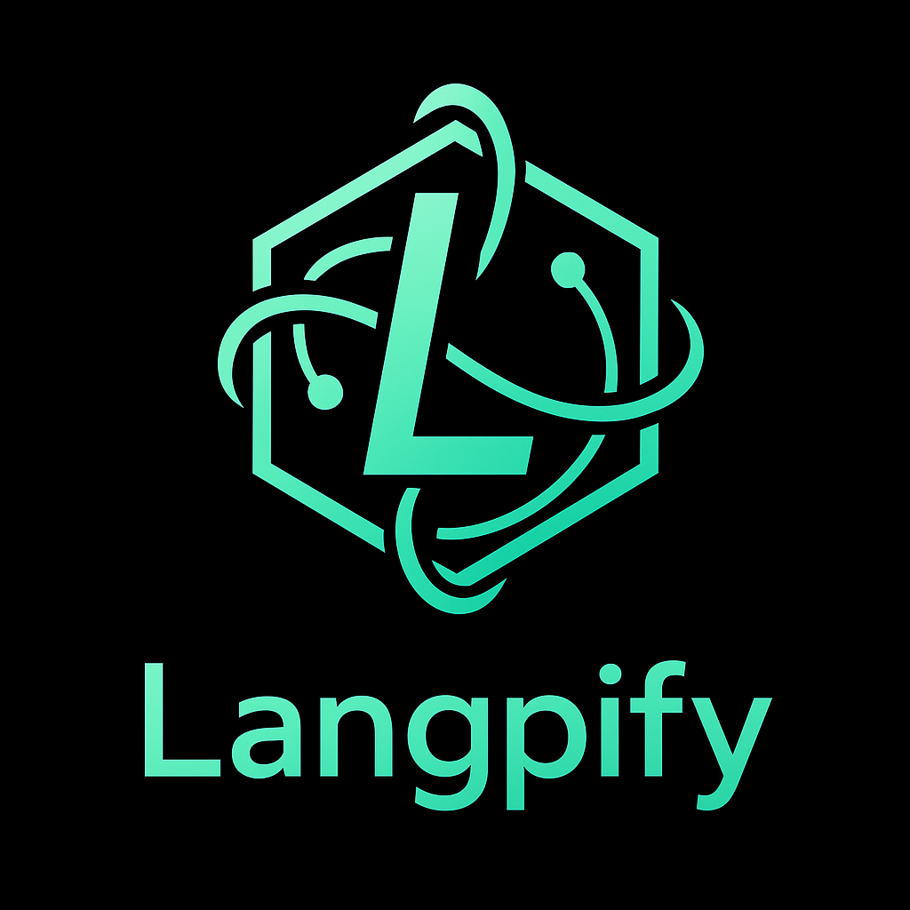
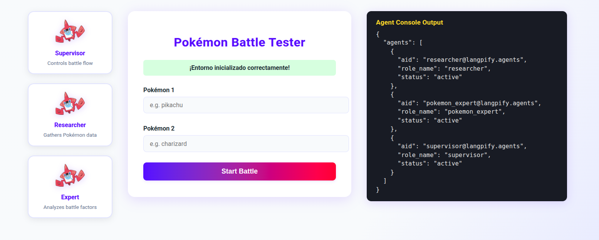
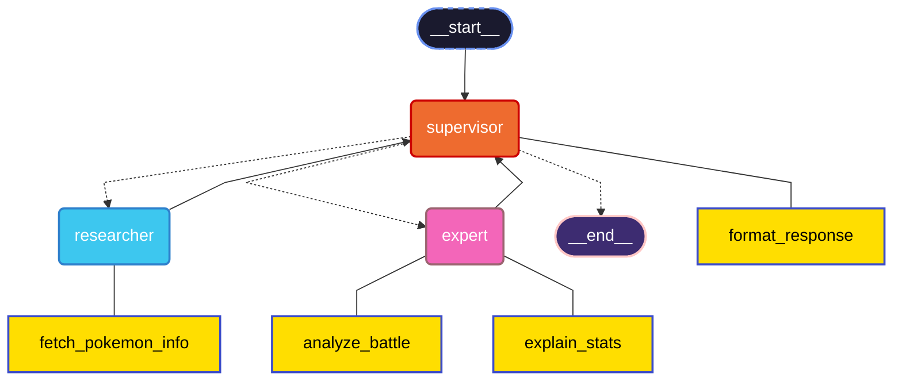

# Langpify Multi-Agent System for Pokémon

A multi-agent system built with Langpify/LangGraph/LangChain and FastAPI for answering questions about Pokémon, retrieving Pokémon data, simulating Pokémon battles.


## 🚀 Why Langpify?



Langpify acts as a meta-framework, abstracting away the specifics of each agent/LLM framework (LangChain, CrewAI, AutoGen, etc). This allows:
- **Framework agnosticism**: Swap orchestration engines without changing your business logic
- **Cleaner code**: Separation of concerns, less boilerplate
- **Easy extension**: Add new agents, tools, or switch LLM providers with minimal changes
- **Production features**: Built-in support for filtering, rate limits, and security

---

## 🏛️ Architecture: Onion / Domain-Driven Design

This project follows an onion architecture, with clear separation between domain, infrastructure, application, and presentation layers. This enables:
- Testability and maintainability
- Swappable infrastructure (e.g., different databases, LLMs, or agent frameworks)
- Clean dependency injection and configuration

### Folder Structure

```plaintext
pokemon-agent-system-main/
├── app/
│   ├── __init__.py
│   ├── main.py
│   ├── application/
│   │   ├── ai_settings/
│   │   │   └── ai_settings_provider.py
│   │   ├── services/
│   │   │   └── agent_management_service.py
│   │   └── tools/
│   │       ├── tools.py
│   │       └── utils/
│   ├── domain/
│   │   ├── agents/
│   │   │   ├── pokemon_expert/
│   │   │   ├── researcher/
│   │   │   ├── supervisor/
│   │   │   └── templates.py
│   │   ├── entities/
│   │   ├── settings/
│   │   │   ├── ai_config.yaml
│   │   │   ├── ai_settings.py
│   │   │   ├── constants.py
│   │   │   ├── cors.py
│   │   │   ├── limiters.py
│   │   │   ├── log_config.yaml
│   │   │   ├── routers.py
│   │   │   └── static.py
│   │   └── utils/
│   │       └── utils.py
│   ├── infrastructure/
│   │   ├── container/
│   │   │   └── container.py
│   │   ├── entities/
│   │   │   ├── base_agent.py
│   │   │   └── entities.py
│   ├── presentation/
│   │   ├── routers/
│   │   │   ├── agent_routers.py
│   │   │   └── endpoints.py
│   │   └── static/
│   │       ├── battle_minimal.html
│   │       ├── rotom.png
│   │       └── ...
├── tests/
│   ├── __init__.py
│   ├── conftest.py          # Test fixtures and configuration
│   ├── pytest.ini           # Pytest configuration
│   ├── test_routes.py       # API routes tests
│   ├── test_tools.py        # Tools functionality tests
│   └── test_pokemon_utils.py # Pokemon utilities tests
├── .env
├── .gitignore
├── .github/
├── .vscode/
├── Dockerfile
├── docker-compose.yml
├── env-template
├── graph.mermaid
├── gunicorn_conf.py
├── LICENSE
├── Makefile
├── project-structure.txt
├── README.md
├── requirements.txt
```

---

## 🧹 Clean Setup & Separation

- **Separation of Concerns**: Setup logic (static files, routers, DI container, etc.) is modularized for clarity.
- **Settings & Constants**: All configuration is centralized in `domain/settings`.
- **Dependency Injection**: Powered by `dependency_injector` for testability and flexibility.

---

## 🛡️ Production Readiness

- **Rate Limiting**: Built-in via the `throttled` package and custom logic in `limiters.py`.
- **Security**: Request filtering (see `langpify_filter`), CORS, and environment variable management.
- **Gunicorn**: Production server setup with `gunicorn_conf.py` for robust, multi-worker deployments.

---

## 📝 Repository Purpose

This repository provides a robust, extensible, and production-ready multi-agent system for simulating and analyzing Pokémon battles using LLMs and agent frameworks. It demonstrates best practices in:
- Agent orchestration
- Clean architecture
- API design
- Security and production hardening

---

## 🌐 API Endpoints

### Main App Routes

| Route                                 | Method | Description                                    |
|---------------------------------------|--------|------------------------------------------------|
| `/agents/environment`                 | POST   | Initialize the agent environment (must call before agent calls) |
| `/agents/system/battle`               | GET    | Simulate a battle between two Pokémon (query params: `pokemon1`, `pokemon2`) |
| `/agents/system/chat`                 | POST   | General chat endpoint for interacting with the agent system |
| `/agents/battle_minimal`              | GET    | Serve the minimalistic GUI for battle testing  |
| `/static/battle_minimal.html`         | GET    | Direct access to the minimal GUI HTML          |
| `/docs`                               | GET    | Auto-generated OpenAPI docs (Swagger UI)       |
| `/redoc`                              | GET    | Alternative API docs (ReDoc)                   |

> **Note:** All `/agents/*` routes are prefixed due to router configuration.

### Where to Find API Documentation
- **Swagger UI**: [http://localhost:8000/docs](http://localhost:8000/docs)
- **ReDoc**: [http://localhost:8000/redoc](http://localhost:8000/redoc)

---

## 🤖 Agents & Interaction

- **Supervisor Agent**: Analize user inputs, orchestrates, delegates to other agents, and aggregates results.
- **Researcher Agent**: Gathers and analyzes Pokémon data (stats, types, etc).
- **Expert Agent**: Provides reasoning and verdict on battle outcome based on Pokémon characteristics.

Agents interact via LangGraph workflows, with Langpify providing abstraction and orchestration. The system uses a multi-agent approach where the Supervisor coordinates the specialized agents to produce comprehensive battle analyses.

---

## 🛡️ Langpify Filter & Security

- **langpify_filter**: Optional pre-processing hook to sanitize and validate user input before passing to agents.
- **Security Measures**: Rate limits, CORS, environment variable management, and modular settings.

---

## 🖥️ Accessing the GUI

You can access the minimal battle GUI at:

```
http://localhost:8000/static/battle_minimal.html
```



- **Features:**
  - Initialize the environment
  - Enter two Pokémon names
  - See agent responses and raw outputs
  - Visual, modern, and responsive design

---


## 📦 How to Run (Development)

1. Clone the repo and install dependencies:
   ```sh
   make install
   ```
2. Run the app locally:
   ```sh
   make run
   ```
3. Run tests:
   ```sh
   make test
   ```

---

## 📄 License

MIT License. See [LICENSE](LICENSE).


### Prerequisites

- Python 3.9+
- Docker (optional)

### Environment Variables

Create a `.env` file in the root directory with the following variables:

```
ENVIRONMENT=DEVELOPMENT
MODEL_PROVIDER=groq
OPENAI_API_KEY=your_openai_api_key
GROQ_API_KEY=your_groq_api_key
DEBUG=False
LOG_LEVEL=INFO
TEMP_DIR=/tmp
```

You can use any compatible LLM provider by modifying the configuration in `app/graph/agent_graph.py`.

### Installation

#### Using Python

1. Clone the repository:
   ```
   git clone https://github.com/yourusername/pokemon-multi-agent.git
   cd pokemon-multi-agent
   ```

2. Create a virtual environment:
   ```
   python -m venv venv
   source venv/bin/activate  # On Windows: venv\Scripts\activate
   ```
   or with `uv` (recommended):
   ```
   uv venv
   source .venv/bin/activate  # On Windows: .venv\Scripts\activate
   ```

3. Install dependencies:
   ```
   make setup-uv
   ```
   or
   ```
   make setup
   ```
   or
   ```
   pip install -r requirements.txt
   ```

4. Run the application:
   ```
   make PORT=8080 run
   ```
   or
   ```
   uvicorn app.main:app --reload --port 8080
   ```

#### Using Docker

1. Build Docker image:
   ```
   make build-docker
   ```
   or
   ```
   docker build -t pokemon-multi-agent .
   ```
2. Run with Docker Compose:
   ```
   make run-docker  # On Windows: Need to edit docker compose to docker-compose
   ```
   or
   ```
   docker compose up -d  # On Windows: Need to edit docker compose to docker-compose
   ```

3. To stop the Docker container:
   ```
   make stop-docker # On Windows: Need to edit docker compose to docker-compose
   ```
   or
   ```
   docker compose down # On Windows: Need to edit docker compose to docker-compose
   ```

## Usage

Once the server is running, you can access the API at `http://localhost:8080`.


## Testing

The project includes comprehensive tests for routes, tools, and utilities. The test suite is organized as follows:

- **test_routes.py**: Tests for the FastAPI routes and endpoints
- **test_tools.py**: Tests for the agent tools functionality
- **test_pokemon_utils.py**: Tests for the Pokémon utility functions

Run the tests with:

```
make test
```
or
```
python -m pytest
```

For more verbose output, use:

```
python -m pytest -v
```


## Agent Graph




## LangSmith Tracing

The system supports [LangSmith](https://smith.langchain.com/) tracing for monitoring, debugging, and optimizing the LLM application workflow. LangSmith provides visibility into:

- Agent execution paths
- Tool usage and performance
- LLM prompt/response pairs
- Execution times and token usage

### Setting up LangSmith Tracing

1. Create a LangSmith account at [LangSmith](https://smith.langchain.com/)
2. Add the following variables to your `.env` file:
   ```
   LANGSMITH_TRACING=true
   LANGSMITH_ENDPOINT="https://api.smith.langchain.com"
   LANGSMITH_API_KEY="your_langsmith_api_key"
   LANGSMITH_PROJECT="your_langsmith_project"
   ```

3. Monitor your agent runs in the LangSmith UI to:
   - Debug agent decision-making
   - Optimize prompts and tools
   - Analyze token usage and performance
   - Share traces with your team

### Benefits of LangSmith Tracing

- **Debugging**: Visualize the complete execution flow of each agent, including internal reasoning steps
- **Prompt Optimization**: Analyze which prompts are most effective for different agent roles
- **Performance Monitoring**: Track token usage, latency, and other metrics to identify bottlenecks
- **Quality Assurance**: Evaluate agent outputs and decision quality over time
- **Collaboration**: Share traces with team members to collaboratively debug and improve the system

The system uses the `@traceable` decorator on key functions to automatically send execution traces to LangSmith when enabled.

## Contributing

Contributions are welcome! Please feel free to submit a Pull Request.

## License

This project is licensed under the MIT License - see the LICENSE file for details.
